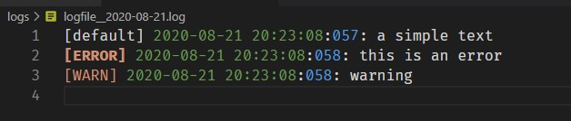

# HOLE-LOG
A simple node logger with 3 channels (default, warn and error)

# Usage
- Without config (defaults to 'logs' folder):

    ```js
    const holeLog = require('hole-log')();
    ```

- Configuring:
    ```js
    const holeLog = require('hole-log')({ folder: 'my_logs' });
    ```


```js
holeLog.log("a simple text");
holeLog.warn("warning");
holeLog.error("this is an error");
```
## Results:



# How it works?

Hole-Log will generate a .log file inside the configuration folder for each day, with the format 'logfile__YYYY-MM-DD_HH-mm-ss-SSS.log'


